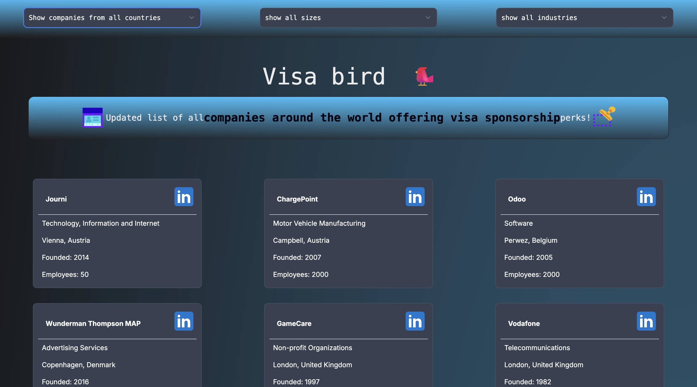

# 🌍 VisaBird – Visa Sponsorship Companies Finder

## [Click to view Live website](https://www.visabird.ir) - https://www.visabird.ir

**VisaBird** is a minimal and user-friendly web app that helps users explore companies that sponsor work visas in various countries such as the United Kingdom, Canada, and Germany. It provides easy filtering and company information at a glance using real-time, community-sourced data.



## 🚀 Features

* 🔎 **Filter by Country, Industry, and Sponsorship Status**
* 🌐 **Clean UI with Light/Dark Mode Support**
* 📦 **Built with Next.js 14, Tailwind CSS, and TypeScript**
* 📊 **Open-source data powered by community contributions**
* 📱 **Responsive Design for all screen sizes**

## 🛠️ Tech Stack

* **Next.js**
* **TypeScript**
* **Tailwind CSS**
* **React**
* **Icons8**

## 📁 Initial Folder Structure

```
├── components/        # Reusable UI components
├── pages/             # Next.js pages
├── public/            # Static assets (icons, images)
├── styles/            # Global styles (Tailwind setup)
├── utils/             # Utility functions (e.g. prefix.js)
```

## 📦 Installation

```bash
git clone https://github.com/abolfazlchaman/visasponsors.git
cd visasponsors
pnpm install
pnpm run dev
```

Visit `http://localhost:3000` in your browser.

## 🧑‍💻 Contributing

We welcome contributions to both the data and the website.

* Contribute to the **data**:
  [https://github.com/SiaExplains/visa-sponsorship-companies](https://github.com/SiaExplains/visa-sponsorship-companies)

* Contribute to the **website**:
  [https://github.com/abolfazlchaman/visasponsors](https://github.com/abolfazlchaman/visasponsors)

## 🙏 Credits

* App built by [**Abolfazl Chaman**](https://github.com/abolfazlchaman)
* Data provided by [**Siavash Ghanbari**](https://github.com/SiaExplains) and [contributors](https://github.com/SiaExplains/visa-sponsorship-companies#contributors)
* Icons by [Icons8](https://icons8.com)

## 📜 License

MIT License
